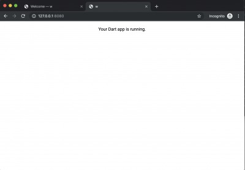

Build dart's development environment with vscode on docker by code-server


(1) run a docker image.
 
```
git clone https://github.com/kyorohiro/dart-code-server.git
cd dart-code-server
docker build -t dart_vscode .
docker run -p 8443:8443 -p 8080:8080 -it dart_vscode bash
```


(2) run vscode at code-server

```
mkdir /works/w
/works/code-server /works/w --allow-http --no-auth
```

(3) and open 'http://127.0.0.1:8443/' at your browser 


## Webdev


(1) Terminal -> New Terminal on VSCODE

(2) on Terminal

```
root@8e5699b9caa4:/works/w# stagehand web-simple
root@8e5699b9caa4:/works/w# pub get
root@8e5699b9caa4:/works/w# webdev serve --hostname=0.0.0.0

```

(3) and, open 'http://127.0.0.1:8080/' at your browser




# PS

[a] restart a container


```
$ docker ps -a
check id and
$ docker exec -it < id > bash
```

[b] reset configure which like port and mount etc.

$ docker commit < id > dart_vscode_xxx
$ docker run -p 8443:8443 -p 8080:8080 -it dart_vscode_xxx bash

[c] mount volume

$ docker run -p 8443:8443 -p 8080:8080 -v /Users/kyorohiro/w/dart/xxx:/works/w -it dart_vscode bash


# MY CODE-SERVER is There
https://github.com/kyorohiro/my-code-server
